<h1>Online Shopping App</h1>

This Repo has an online shopping app that allow user to add products to fav or to cart and buy it online also user can contact to our admin in realtime chat   also can see his last orders he bought it   and more options  

<h3>App Screen Shots</h3>
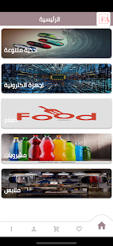
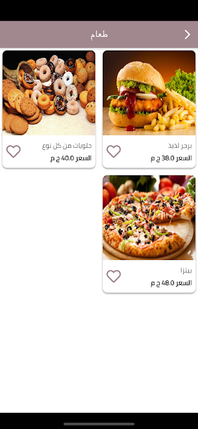
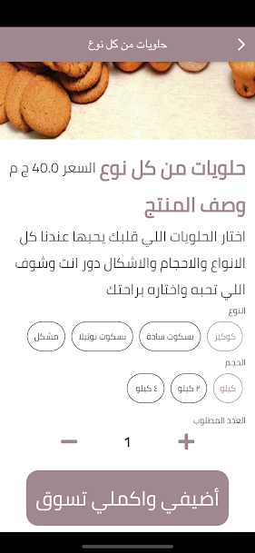
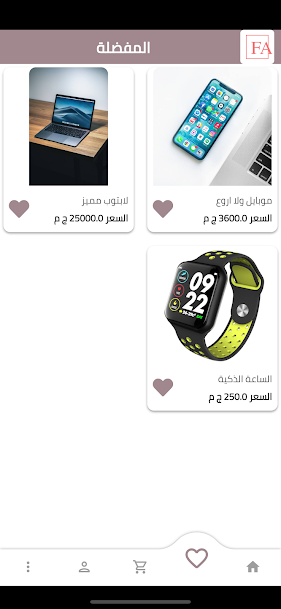
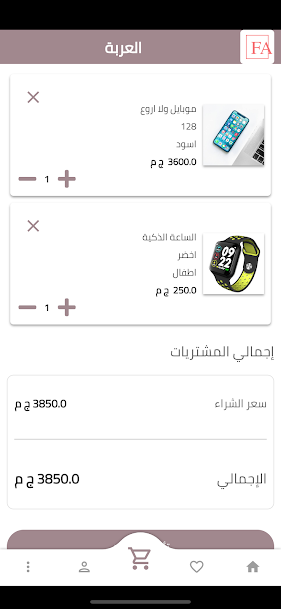

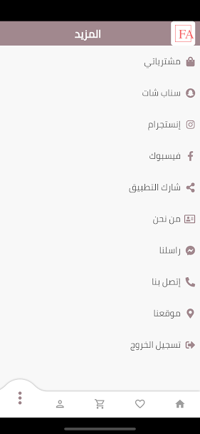

<h3>Now We Also Have Our Admin Panel That We Can Control App From It</h3>

also this control panel can do the following   first we can add, edit or delete products and categories   also we can see all orders that users order it   can chat with users with realtime chat online   and more features

<h3>Control Panel Screen Shots</h3>

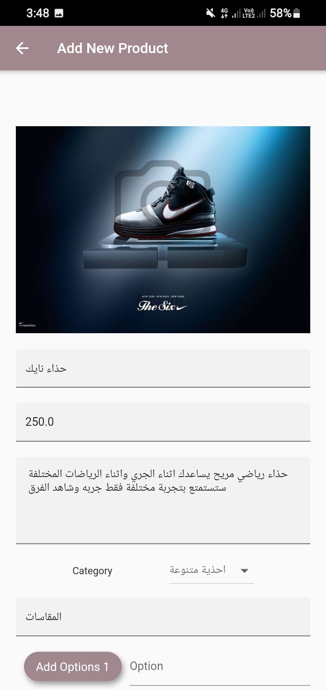
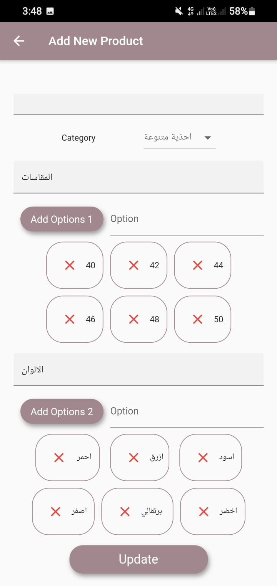
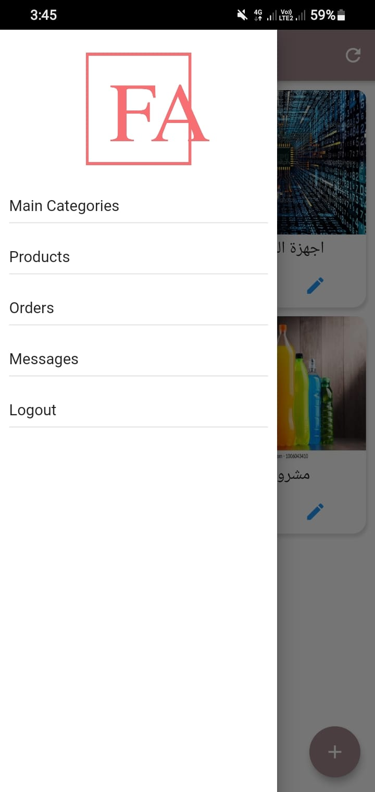
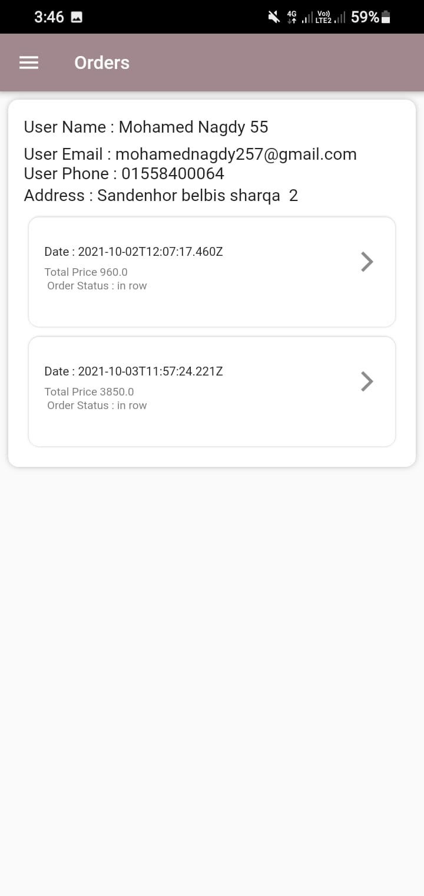
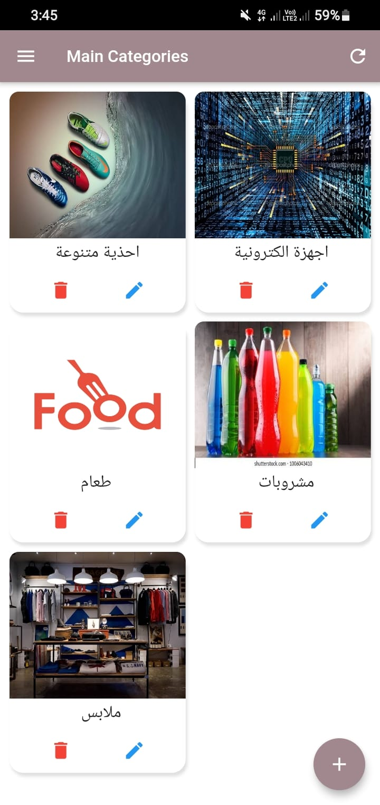
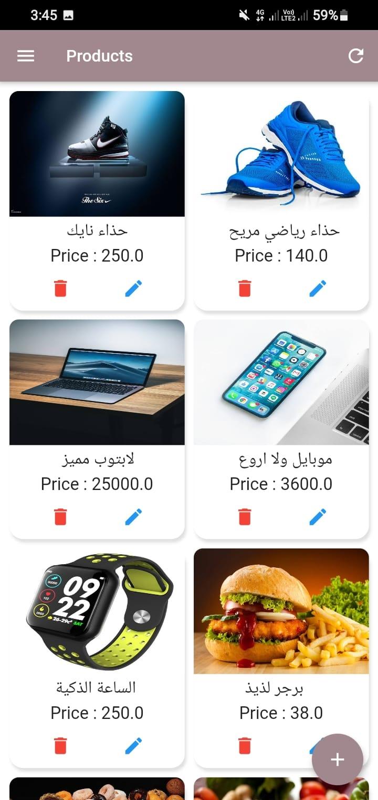
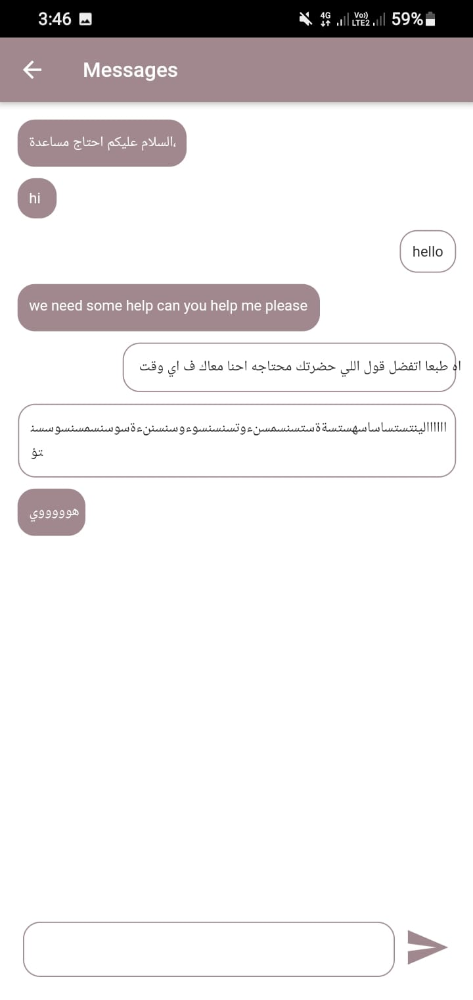

<h1>App Server</h1>

Of course we will organize all this process using server and we have a storng server using node.js programming language   we use it and we have use technologies to manage this app like jwt and encryption user passwords   and also for database we
    used mongodb for fast user experience   try demo now

<a rel="stylesheet" href="https://play.google.com/store/apps/details?id=com.opensource.opensourceshop&fbclid=IwAR1vb_US1o6nDgKBaOCjpQUOEHJNH6-H5-wo9QUGEtuNuV_q3ihEx1PwBeA">App Store Link</a>
 
<a rel="stylesheet" href="https://stores-online.netlify.app/#/welcomeScreen">Website Link</a>